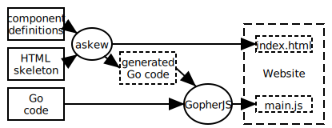

<p align=center><h1>Askew</h1></p>

<p align=center><h2>A code generator for building single-page web applications with GopherJS</h2></p>

Askew is a tool that reads annotated HTML sources and generates Go code from it.
The generated code provides means to build a single-page web application via modular components.
You compile your application to JavaScript with GopherJS.

Askew does not contain a single line of JavaScript, nor does it depend on any JavaScript libraries.

### Overview



You define your components inside one or more files containing annotated HTML.
Annotated HTML consists of standard HTML structure and additional elements and attributes whose name starts with `a:`.
These annotations are processed by Askew.

You structure your HTML components in packages (`<a:package>`).
Each package contains one or more components (`<a:component>`).
Askew will generate a Go package from each `<a:package>` and a Go type for each `<a:component>`.

The HTML input will be transformed into a list of `<template>` nodes corresponding to one component each.
This list must be included in the final HTML file.
The templates are used to instantiate components in the generated Go code.

### Example

Let's define a component as well as the skeleton of our website in annotated HTML:

```html
<!-- components.html -->
<a:package name="ui">
  <a:component name="Greeter">
    <!-- defines a handler for the component.
         Handlers translate to Go methods. -->
    <a:handler>Greet()</a:handler>
    <!-- a:capture binds DOM events to defined handlers. -->
    <form a:capture="submit:Greet">
      <label for="Name">What's your name?</label>
      <!-- a:bindings binds items in the DOM to Go accessors.
           in this case, we get a bool accessor that switches
           the class "hasError" on or off on this element. -->
      <p a:bindings="class(hasError):HasError">
        <!-- input values are wrapped automatically with accessors
             if they have a Name. -->
        <input name="Name">
        <!-- a:bindings can also bind to DOM node properties. -->
        <span a:bindings="prop(textContent):ErrorMsg"></span>
      </p>
      <button type="submit">Greet</button>
    </form>
  </a:component>
</a:package>
```

```html
<!-- skeleton.html -->
<!doctype html>
<html lang="en">
<head>
  <title>Example</title>
  <style>
    .hasError {
      background-color: #66f;
    }
  </style>
</head>
<body>
  <h1>Askew Greeter Example</h1>
  <!-- embed our component here and give the instance the name `Form`. -->
  <a:embed name="Form" type="ui.Greeter"></a:embed>
  <!-- Askew will inject the templates for the components here -->
  <a:templates></a:templates>
  <!-- load the generated JavaScript code -->
  <script src="main.js"></script>
</body>
</html>
```

To generate code, we must execute Askew in the main directory of our Go module where a `go.mod` is located.
This is needed by Askew to generated cross-package import paths.

    mkdir -p site
    askew -o . -i site/index.html -s skeleton.html components.html

This will generate the following files:

    init.go
    ui/
      greeter.go
    site/
      index.html

Now we need to implement the handler we defined (Askew generates code that calls it, but doesn't implement it).
Put this in `ui/greetercontrol.go`:

```go
package ui

import "github.com/gopherjs/gopherjs/js"

func (o *Greeter) Greet() bool {
  switch name := o.Name.Get(); name {
    case "":
      o.HasError.Set(true)
      o.ErrorMsg.Set("please tell me your name")
    case "petaQ":
      o.HasError.Set(true)
      o.ErrorMsg.Set("I'm not calling you that")
    default:
      o.HasError.Set(false)
      o.ErrorMsg.Set("")
      js.Global.Call("alert", "Hello, " + name + "!")
  }
}
```

Finally, we need to have a `main.go` in the module root:

```go
package main

func main() {
  // set default name
  Form.Name.Set("World")
}
```

Compile it with GopherJS:

    gopherjs build -o site/main.js

Now open `site/index.html` to run your single-page application!

### Syntax Documentation

TBD

### License

MIT